# 🌍 TheKnowledgeOrbits

**AI-Powered Ed-Tech Platform for UPSC Aspirants**
_Engine-First Django/Next.js Architecture | Built for Scale | Solo-Developed_

<p align="center">
  <a href="https://theknowledgeorbits.com"></a>
</p>

<p align="center">
  <sub><b>⚙️ Backend &amp; Core</b></sub><br>
  
  
  
  
  
  
  
  
  <br>
  <sub><b>🗄️ Database &amp; Cache</b></sub><br>
  
  
  
  
  <br>
  <sub><b>🧠 AI / ML / LLMOps</b></sub><br>
  
  
  
  
  
  
  
  
  
  <br>
  <sub><b>💻 Frontend</b></sub><br>
  
  
  
  
  
  
  <br>
  <sub><b>☁️ Infrastructure &amp; DevOps</b></sub><br>
  
  
  
  
  
  
  
  <br>
  
</p>

<!-- Screenshot: landing / home page. Save as assets/screenshots/hero.png -->
<p align="center">
  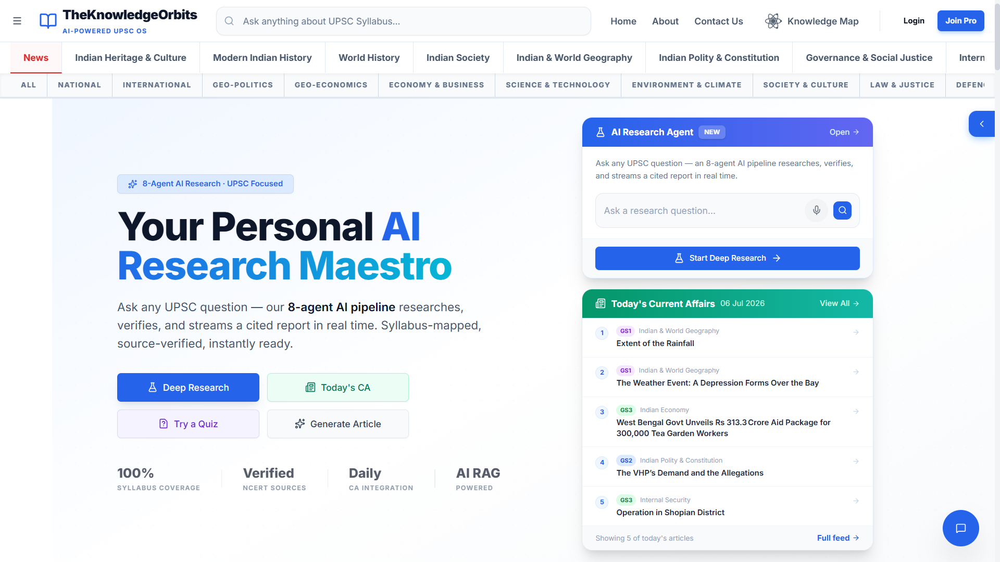
</p>

---

<details>
<summary><b>📑 Table of Contents</b></summary>

- [Overview](#-overview)
  - [System at a Glance](#️-system-at-a-glance)
  - [Core Design Principles](#-core-design-principles)
- [Key Features](#-key-features)
- [Screenshots](#-screenshots)
- [Architecture](#️-architecture)
  - [The RAG Pipeline (the core)](#-the-rag-pipeline-the-core)
  - [One Gateway, Many Consumers](#one-gateway-many-consumers)
  - [Technology Stack](#technology-stack)
  - [Engine Overview](#engine-overview)
- [Architecture Deep-Dives](#-architecture-deep-dives)
  - [Daily Current-Affairs Pipeline](#-daily-current-affairs-pipeline-fully-automated)
  - [Request Lifecycle & Deployment Topology](#-request-lifecycle--deployment-topology)
  - [Authentication, Email Verification & RBAC Flow](#-authentication-email-verification--rbac-flow)
  - [Testing & CI/CD](#-testing--cicd--local--github-actions--render)
  - [Data Model — Knowledge Hierarchy & RAG Spine](#️-data-model--knowledge-hierarchy--rag-spine)
  - [Research Agent — LangGraph Workflow](#-research-agent--langgraph-workflow)
  - [LLM Pool (Research Agent)](#-llm-pool-research-agent--multi-provider-failover)
  - [Caching Layers](#-caching-layers)
- [LLMOps & AgentOps — Operating the Agent](#-llmops--agentops--operating-the-agent)
  - [Observability & Tracing (Langfuse)](#-llmops--observability--tracing-langfuse)
  - [Quality Evaluation & Cost Governance](#-llmops--quality-evaluation--cost-governance)
  - [Session Lifecycle & Orchestration](#-agentops--session-lifecycle--orchestration)
  - [Live Streaming, Cancellation & Guardrails](#-agentops--live-streaming-cancellation--guardrails)
- [Local Development Setup](#-local-development-setup)
- [License](#-license)
- [Security](#-security)
- [Author](#-author)
- [Contact](#-contact)

</details>

---

## 📋 Overview

TheKnowledgeOrbits is an AI-accelerated exam-prep platform for UPSC Civil Services aspirants. It
combines a curated static knowledge base (NCERT/standard-book content) with live current-affairs
ingestion to generate contextual, retrieval-grounded study material — daily current-affairs articles,
public quizzes, evergreen theory content, and an agentic AI research assistant.

### 🗺️ System at a Glance

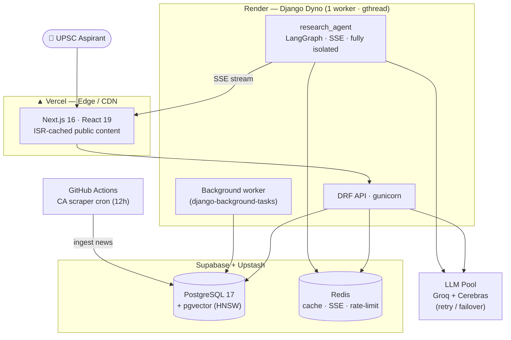
```mermaid
flowchart TB
    User([👤 UPSC Aspirant])

    subgraph Edge["▲ Vercel — Edge / CDN"]
        FE["Next.js 16 · React 19<br/>ISR-cached public content"]
    end

    subgraph Render["Render — Django Dyno (1 worker · gthread)"]
        API["DRF API · gunicorn"]
        Worker["Background worker<br/>(django-background-tasks)"]
        RA["research_agent<br/>LangGraph · SSE · fully isolated"]
    end

    subgraph Data["Supabase + Upstash"]
        PG[("PostgreSQL 17<br/>+ pgvector (HNSW)")]
        Redis[("Redis<br/>cache · SSE · rate-limit")]
    end

    LLM["LLM Pool<br/>Groq + Cerebras<br/>(retry / failover)"]
    GHA["GitHub Actions<br/>CA scraper cron (12h)"]

    User --> FE --> API
    API --> PG
    API --> Redis
    API --> LLM
    Worker --> PG
    RA -->|SSE stream| FE
    RA --> LLM
    RA --> Redis
    GHA -->|ingest news| PG
```

### 🎯 Core Design Principles

**Chunk-first content architecture**

- All ingested content (books, current affairs) is split into semantic chunks, embedded, and indexed
  for hybrid (keyword + vector) retrieval — never stored or served as raw, unstructured text.
- Generated content (daily articles, quizzes) is produced by retrieving the most relevant chunks and
  grounding an LLM call in them — a Retrieval-Augmented Generation (RAG) pipeline, not free-form
  generation.

**Engine-first backend**

- The backend is organized into independent Django apps ("engines"), each owning one responsibility
  (content ingestion, current affairs, assessment, authentication, authorization, the AI research
  agent, etc.).
- Engines communicate through APIs/shared infrastructure, not direct cross-engine model imports — the
  `research_agent` engine in particular is fully isolated from the rest of the platform.

---

## ✨ Key Features

### 📚 Content & Knowledge

- PDF/text ingestion with semantic chunking (~1200-character chunks, sentence-boundary aware)
- pgvector-backed embedding storage with HNSW indexing for fast similarity search
- Hybrid retrieval: PostgreSQL full-text search (BM25-style) + vector similarity, fused via
  Reciprocal Rank Fusion
- A syllabus-driven knowledge hierarchy (Subject → Module → Topic) underlying both static content and
  retrieval scoping

### 📰 Current Affairs Automation

- Scheduled RSS scraping, chunking, and embedding of daily news (via a GitHub Actions cron job)
- Cross-linking between current-affairs content and the static syllabus via topic-relation graphs
- A fully automated nightly pipeline: score news → auto-approve → generate daily articles + a public
  quiz → publish — zero manual intervention required

### 🧠 Retrieval-Grounded AI Generation

- A shared RAG "grounding gateway" every content generator calls through — cross-subject theory
  retrieval + recency-scoped current-affairs retrieval, relevance-gated (not subject-gated)
- Multi-provider LLM pool (Groq + Cerebras) with retry/failover
- An agentic AI research assistant (LangGraph-orchestrated, multi-node) with live web search, SSE
  streaming, and LLM-as-judge evaluation — architecturally isolated from the rest of the platform

### 🔐 Authentication & Authorization

- Custom email-based user model, JWT authentication (SimpleJWT)
- Role-based access control (admin / content manager / student / free user)
- Production-hardened settings: HTTPS/HSTS enforcement, secure cookies, CORS/CSRF configured for a
  split frontend/backend deployment

### 📊 Assessment & Progress

- Auto-generated daily public quizzes and topic-wise practice quizzes
- Per-user attempt tracking and mastery scoring

---

## 📸 Screenshots

> A quick visual tour of the live platform.

<!--
  Add your screenshots to assets/screenshots/ using these exact filenames:
    daily-current-affairs.png · research-agent.png · daily-quiz.png · knowledge_map.png
  PNG or JPG, ~1200px wide renders best. Broken-image icons below are normal until the files are added.
-->

|                 📰 AI-generated Daily Current Affairs                  |        🤖 Agentic Research Assistant (live SSE + React Flow)         |
| :--------------------------------------------------------------------: | :------------------------------------------------------------------: |
| 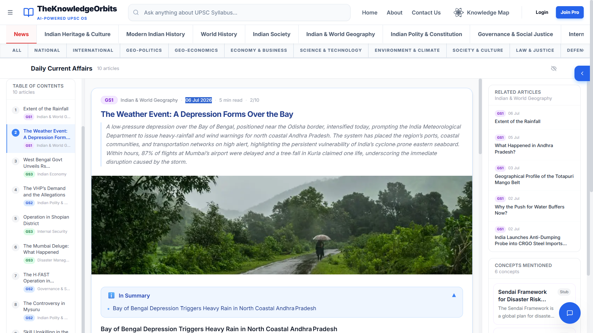 | 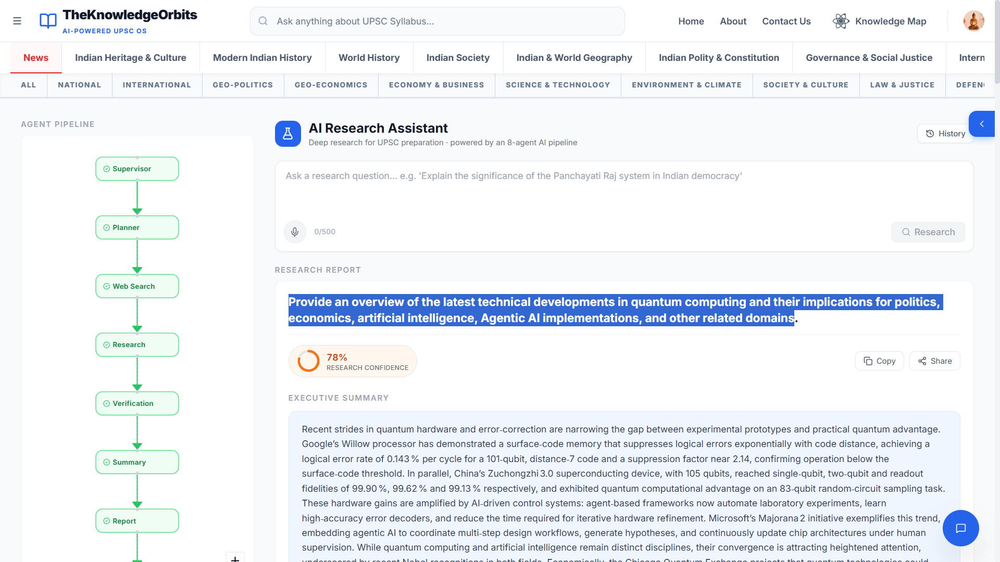 |
|                       **🧠 Auto-generated Quiz**                       |                   **🗺️ Interactive Knowledge Map**                   |
|            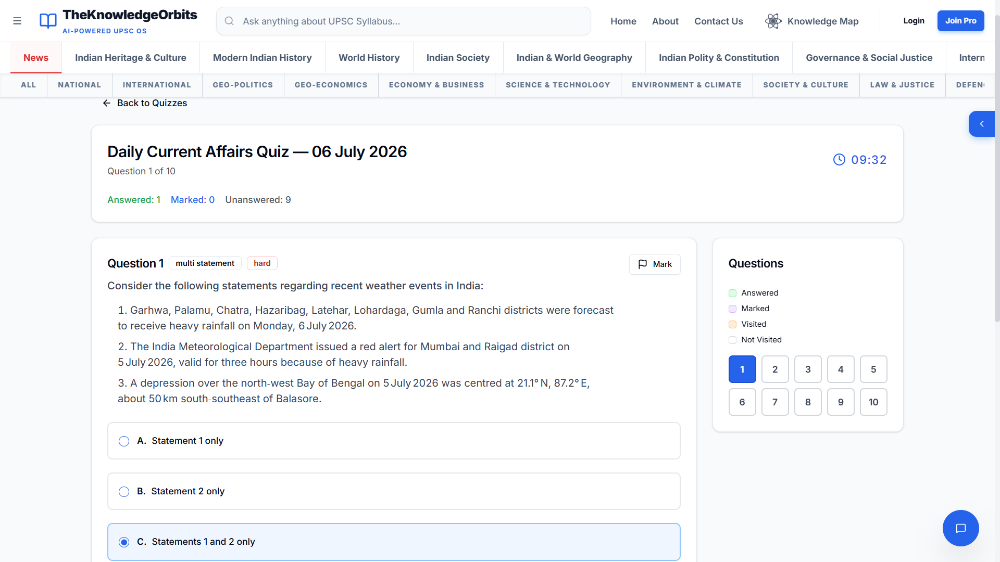            |        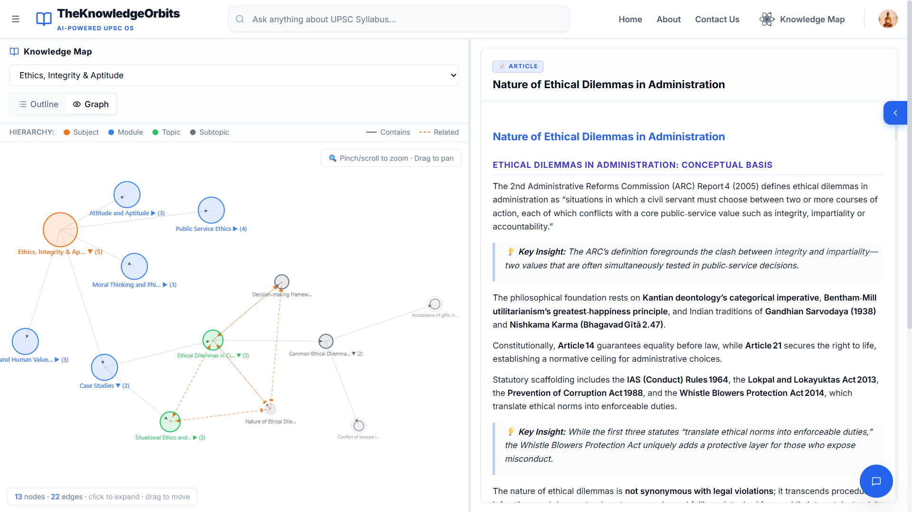        |

> 📄 **Full generated output:** [read a complete sample report produced by the Research Agent (PDF) →](assets/research-agent-sample-report.pdf)

---

## 🏗️ Architecture

### 🔎 The RAG Pipeline (the core)

Every content generator (daily articles, quizzes, theory) calls through a single shared grounding
gateway — no free-form LLM generation. Retrieval is hybrid, fused, and relevance-gated:

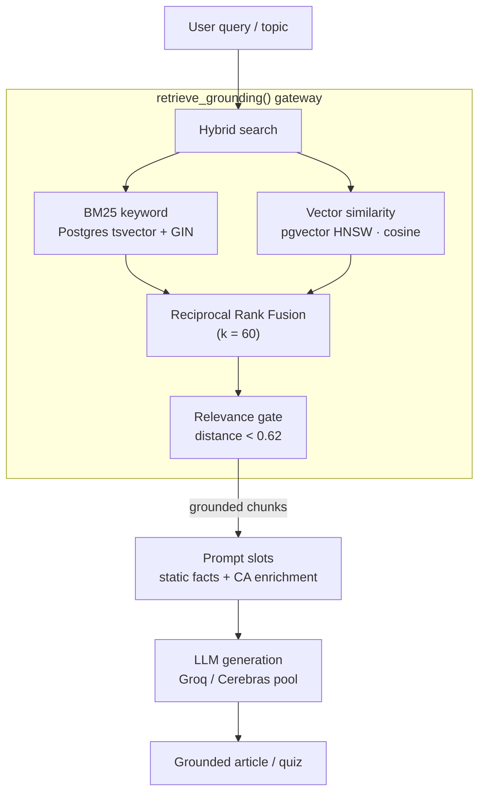
```mermaid
flowchart TB
    Q["User query / topic"] --> HS

    subgraph GW["retrieve_grounding() gateway"]
        direction TB
        HS["Hybrid search"]
        BM["BM25 keyword<br/>Postgres tsvector + GIN"]
        VEC["Vector similarity<br/>pgvector HNSW · cosine"]
        RRF["Reciprocal Rank Fusion<br/>(k = 60)"]
        GATE["Relevance gate<br/>distance &lt; 0.62"]
        HS --> BM
        HS --> VEC
        BM --> RRF
        VEC --> RRF
        RRF --> GATE
    end

    GATE -->|grounded chunks| PROMPT["Prompt slots<br/>static facts + CA enrichment"]
    PROMPT --> LLM["LLM generation<br/>Groq / Cerebras pool"]
    LLM --> OUT["Grounded article / quiz"]
```

#### One Gateway, Many Consumers

The real architectural bet: **a single `retrieve_grounding()` gateway grounds every generator on the
platform.** Four independent content pipelines call the _same_ hybrid-retrieval pool, get back the
_same_ `GroundingResult` shape, and adapt it into their own prompt slots — Wikipedia is a fallback
only (used when the gateway returns nothing). No generator owns its own retrieval logic.

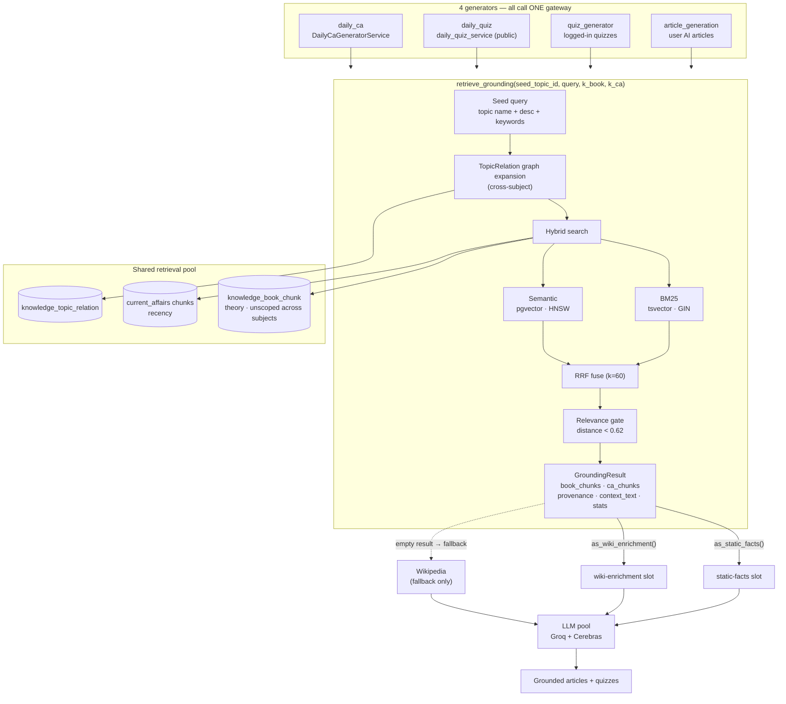
```mermaid
flowchart TB
    subgraph Consumers["4 generators — all call ONE gateway"]
        C1["daily_ca<br/>DailyCaGeneratorService"]
        C2["daily_quiz<br/>daily_quiz_service (public)"]
        C3["quiz_generator<br/>logged-in quizzes"]
        C4["article_generation<br/>user AI articles"]
    end

    C1 --> GW
    C2 --> GW
    C3 --> GW
    C4 --> GW

    subgraph GW["retrieve_grounding(seed_topic_id, query, k_book, k_ca)"]
        direction TB
        SEED["Seed query<br/>topic name + desc + keywords"] --> EXP["TopicRelation graph expansion<br/>(cross-subject)"]
        EXP --> HS["Hybrid search"]
        HS --> BM["BM25<br/>tsvector · GIN"]
        HS --> VE["Semantic<br/>pgvector · HNSW"]
        BM --> RRF["RRF fuse (k=60)"]
        VE --> RRF
        RRF --> GATE["Relevance gate<br/>distance &lt; 0.62"]
        GATE --> RES["GroundingResult<br/>book_chunks · ca_chunks<br/>provenance · context_text · stats"]
    end

    subgraph Pool["Shared retrieval pool"]
        BC[("knowledge_book_chunk<br/>theory · unscoped across subjects")]
        CA[("current_affairs chunks<br/>recency")]
        TR[("knowledge_topic_relation")]
    end
    HS --> BC
    HS --> CA
    EXP --> TR

    RES -->|"as_static_facts()"| S1["static-facts slot"]
    RES -->|"as_wiki_enrichment()"| S2["wiki-enrichment slot"]
    RES -.->|empty result → fallback| WIKI["Wikipedia<br/>(fallback only)"]

    S1 --> LLM2["LLM pool<br/>Groq + Cerebras"]
    S2 --> LLM2
    WIKI --> LLM2
    LLM2 --> OUT2["Grounded articles + quizzes"]
```

### Technology Stack

**Backend**

- Python 3.11, Django 5.0, Django REST Framework 3.15
- PostgreSQL 17 + `pgvector` (hybrid search: HNSW vector index + GIN full-text index)
- Redis (Upstash) — caching, rate limiting, SSE pub/sub, production sessions
- `django-background-tasks` for asynchronous/background work (not Celery)

**AI / ML**

- Groq + Cerebras (LLM generation, pooled with retry/failover)
- `sentence-transformers` (`all-MiniLM-L6-v2`, 384-dim embeddings — local or via HuggingFace
  Inference API depending on environment)
- LangGraph, Pydantic v2, Tavily, Exa, Langfuse (the isolated AI research-agent engine)

**Frontend**

- Next.js 16 (App Router), React 19, TypeScript 5
- Tailwind CSS 3, shadcn/ui
- Incremental Static Regeneration (ISR) for CDN-cached, edge-served public content

**Infrastructure**

- Backend hosting: Render
- Frontend hosting: Vercel
- Database: Supabase (managed Postgres + pgvector, PgBouncer connection pooling)
- Media: Cloudinary
- Error tracking: Sentry
- CI/CD: GitHub Actions (lint, sharded test suite, automated deploy gate)
- Containerization: Docker (used for CI/production-style testing only — local development runs
  natively, no containers)

### Engine Overview

The backend is organized as a set of independent Django apps, each with a single responsibility.

<details>
<summary><b>📦 Expand the 15-engine catalog</b></summary>

<br/>

| Engine               | Responsibility                                                        |
| -------------------- | --------------------------------------------------------------------- |
| `content`            | Document/chunk/embedding ingestion (the shared content pipeline)      |
| `knowledge`          | The syllabus hierarchy (Subject → Module → Topic) and topic relations |
| `book_content`       | Evergreen, syllabus-driven theory content generation                  |
| `current_affairs`    | Current-affairs scraping, chunking, and cross-linking                 |
| `daily_ca`           | The daily current-affairs pipeline (proposals → articles → publish)   |
| `assessment`         | Quiz generation, attempts, and daily public quizzes                   |
| `tags`               | Concept/tag taxonomy and concept-page content                         |
| `article_generation` | User-facing AI article generation                                     |
| `auth`               | Custom user model, JWT authentication, email verification/reset       |
| `authorization`      | Role-based access control (roles, permissions, middleware)            |
| `userstate`          | Per-user progress and state tracking                                  |
| `analytics`          | Usage aggregation and reporting                                       |
| `social`             | Social/interaction features                                           |
| `support`            | Support/help features                                                 |
| `research_agent`     | The isolated, agentic AI research assistant (LangGraph)               |

</details>

---

## 🧭 Architecture Deep-Dives

A few core flows, as system-design diagrams. Each reflects the actual production wiring.

### 📰 Daily Current-Affairs Pipeline (fully automated)

Zero manual intervention: news is ingested on a schedule, then a nightly worker scores, auto-approves,
generates, and publishes — 10 daily articles + 1 public quiz, every day.

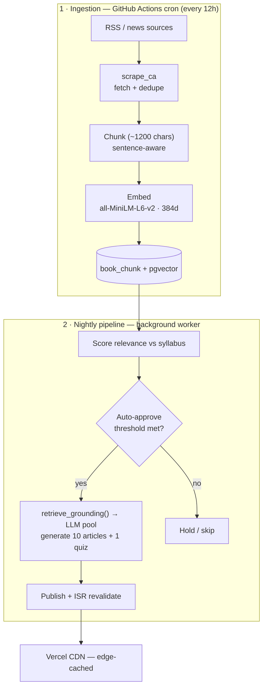
```mermaid
flowchart TB
    subgraph Ingest["1 · Ingestion — GitHub Actions cron (every 12h)"]
        RSS["RSS / news sources"] --> SCRAPE["scrape_ca<br/>fetch + dedupe"]
        SCRAPE --> CHUNK["Chunk (~1200 chars)<br/>sentence-aware"]
        CHUNK --> EMB["Embed<br/>all-MiniLM-L6-v2 · 384d"]
        EMB --> STORE[("book_chunk + pgvector")]
    end

    subgraph Nightly["2 · Nightly pipeline — background worker"]
        SCORE["Score relevance vs syllabus"] --> APPROVE{"Auto-approve<br/>threshold met?"}
        APPROVE -->|yes| GEN["retrieve_grounding() → LLM pool<br/>generate 10 articles + 1 quiz"]
        APPROVE -->|no| HOLD["Hold / skip"]
        GEN --> PUB["Publish + ISR revalidate"]
    end

    STORE --> SCORE
    PUB --> CDN["Vercel CDN — edge-cached"]
```

### 🌐 Request Lifecycle &amp; Deployment Topology

How a request travels edge → Render → database, and how a deploy ships safely (migrations on the
direct port, blue-green swap).

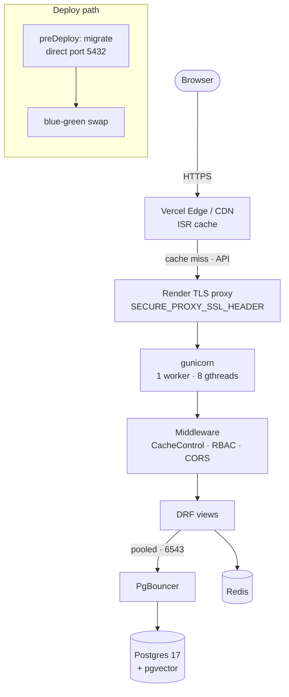
```mermaid
flowchart TB
    U([Browser]) -->|HTTPS| CDN["Vercel Edge / CDN<br/>ISR cache"]
    CDN -->|cache miss · API| RP["Render TLS proxy<br/>SECURE_PROXY_SSL_HEADER"]
    RP --> GU["gunicorn<br/>1 worker · 8 gthreads"]
    GU --> MW["Middleware<br/>CacheControl · RBAC · CORS"]
    MW --> V["DRF views"]
    V -->|pooled · 6543| PGB["PgBouncer"]
    PGB --> PG[("Postgres 17<br/>+ pgvector")]
    V --> RC[("Redis")]

    subgraph Deploy["Deploy path"]
        direction TB
        MIG["preDeploy: migrate<br/>direct port 5432"] --> SWAP["blue-green swap"]
    end
```

### 🔐 Authentication, Email Verification &amp; RBAC Flow

The full identity lifecycle: registration with a 24h email-verification token, non-blocking email
delivery via **Brevo SMTP** (fired on a background thread after commit), stateless JWT login
(HS256), role checks, and a 1h password-reset token — all backed by `auth_user` / `auth_role` /
`auth_role_assignment`. Passwords are hashed with PBKDF2 (Argon2 fallback).

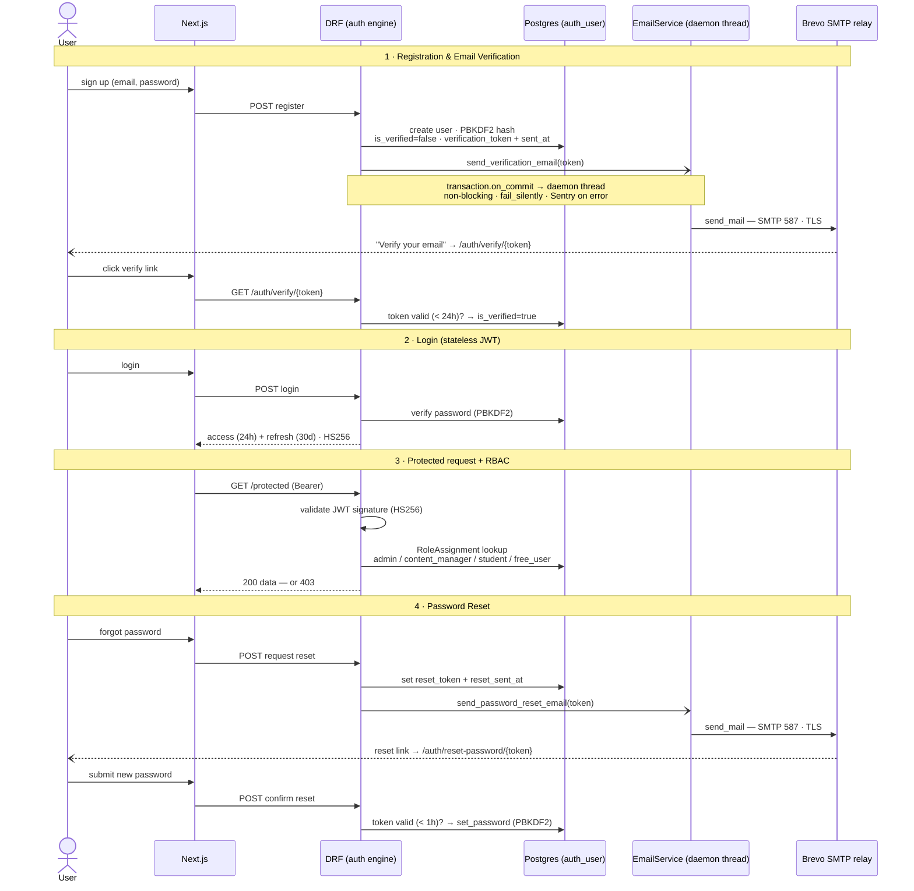
```mermaid
sequenceDiagram
    actor U as User
    participant FE as Next.js
    participant API as DRF (auth engine)
    participant DB as Postgres (auth_user)
    participant MAIL as EmailService (daemon thread)
    participant BREVO as Brevo SMTP relay

    Note over U,BREVO: 1 · Registration & Email Verification
    U->>FE: sign up (email, password)
    FE->>API: POST register
    API->>DB: create user · PBKDF2 hash<br/>is_verified=false · verification_token + sent_at
    API-)MAIL: send_verification_email(token)
    Note over API,MAIL: transaction.on_commit → daemon thread<br/>non-blocking · fail_silently · Sentry on error
    MAIL->>BREVO: send_mail — SMTP 587 · TLS
    BREVO--)U: "Verify your email" → /auth/verify/{token}
    U->>FE: click verify link
    FE->>API: GET /auth/verify/{token}
    API->>DB: token valid (< 24h)? → is_verified=true

    Note over U,BREVO: 2 · Login (stateless JWT)
    U->>FE: login
    FE->>API: POST login
    API->>DB: verify password (PBKDF2)
    API-->>FE: access (24h) + refresh (30d) · HS256

    Note over U,BREVO: 3 · Protected request + RBAC
    FE->>API: GET /protected (Bearer)
    API->>API: validate JWT signature (HS256)
    API->>DB: RoleAssignment lookup<br/>admin / content_manager / student / free_user
    API-->>FE: 200 data — or 403

    Note over U,BREVO: 4 · Password Reset
    U->>FE: forgot password
    FE->>API: POST request reset
    API->>DB: set reset_token + reset_sent_at
    API-)MAIL: send_password_reset_email(token)
    MAIL->>BREVO: send_mail — SMTP 587 · TLS
    BREVO--)U: reset link → /auth/reset-password/{token}
    U->>FE: submit new password
    FE->>API: POST confirm reset
    API->>DB: token valid (< 1h)? → set_password (PBKDF2)
```

### 🧪 Testing &amp; CI/CD — Local → GitHub Actions → Render

Where and when the code gets tested, and exactly what blocks a deploy. **Locally** you run `pytest` /
`npm test` before pushing. On **push (`main`/`develop`), PR (`main`), or manual dispatch**, GitHub
Actions runs **three jobs in parallel** — backend lint (Ruff + mypy), backend tests (3 timing-balanced
shards, each against a real `pgvector` service container: ~5 min vs ~12 min serial), and frontend
(lint + jest + production build). The **deploy job `needs` all three** and only fires on `main`: a
single red check anywhere blocks production.

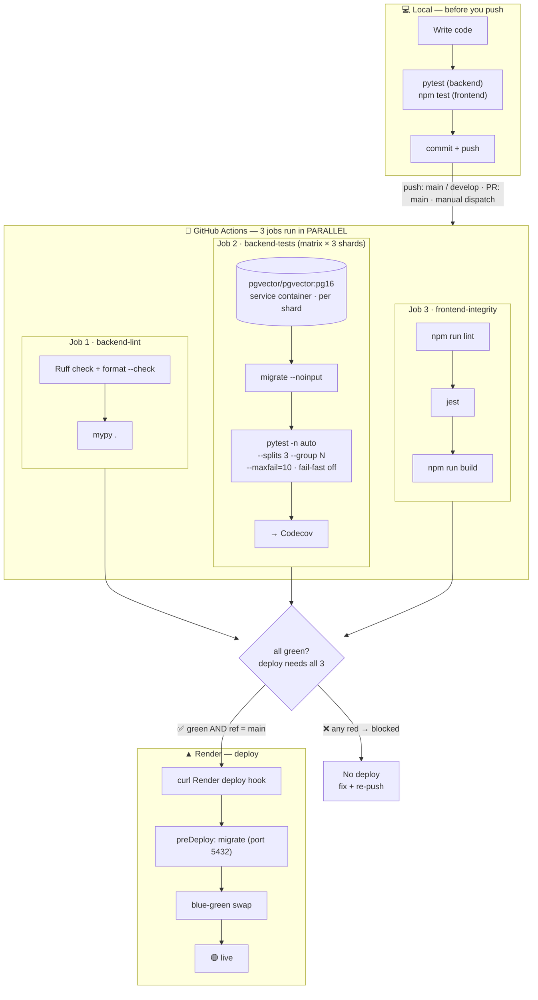
```mermaid
flowchart TB
    subgraph LOCAL["💻 Local — before you push"]
        DEV["Write code"] --> LT["pytest (backend)<br/>npm test (frontend)"]
        LT --> PUSH["commit + push"]
    end

    PUSH -->|"push: main / develop · PR: main · manual dispatch"| GHA

    subgraph GHA["🐙 GitHub Actions — 3 jobs run in PARALLEL"]
        direction LR

        subgraph J1["Job 1 · backend-lint"]
            direction TB
            RUFF["Ruff check + format --check"] --> MYPY["mypy ."]
        end

        subgraph J2["Job 2 · backend-tests (matrix × 3 shards)"]
            direction TB
            PGV[("pgvector/pgvector:pg16<br/>service container · per shard")] --> MIG["migrate --noinput"]
            MIG --> SPLIT["pytest -n auto<br/>--splits 3 --group N<br/>--maxfail=10 · fail-fast off"]
            SPLIT --> COV["→ Codecov"]
        end

        subgraph J3["Job 3 · frontend-integrity"]
            direction TB
            FL["npm run lint"] --> FJ["jest"] --> FB["npm run build"]
        end
    end

    J1 --> GATE{"all green?<br/>deploy needs all 3"}
    J2 --> GATE
    J3 --> GATE

    GATE -->|"❌ any red → blocked"| STOP["No deploy<br/>fix + re-push"]
    GATE -->|"✅ green AND ref = main"| HOOK["curl Render deploy hook"]

    subgraph RENDER["▲ Render — deploy"]
        direction LR
        HOOK --> PRE["preDeploy: migrate (port 5432)"] --> BG["blue-green swap"] --> LIVE["🟢 live"]
    end
```

### 🗂️ Data Model — Knowledge Hierarchy &amp; RAG Spine

The syllabus hierarchy (`Program → Subject → Module → Topic`, with self-referential sub-topics) feeds
the retrieval spine: articles are chunked, each chunk carries a `tsvector` (BM25) and a pgvector
embedding, and topics are cross-linked by cosine similarity. Real `db_table` names shown.

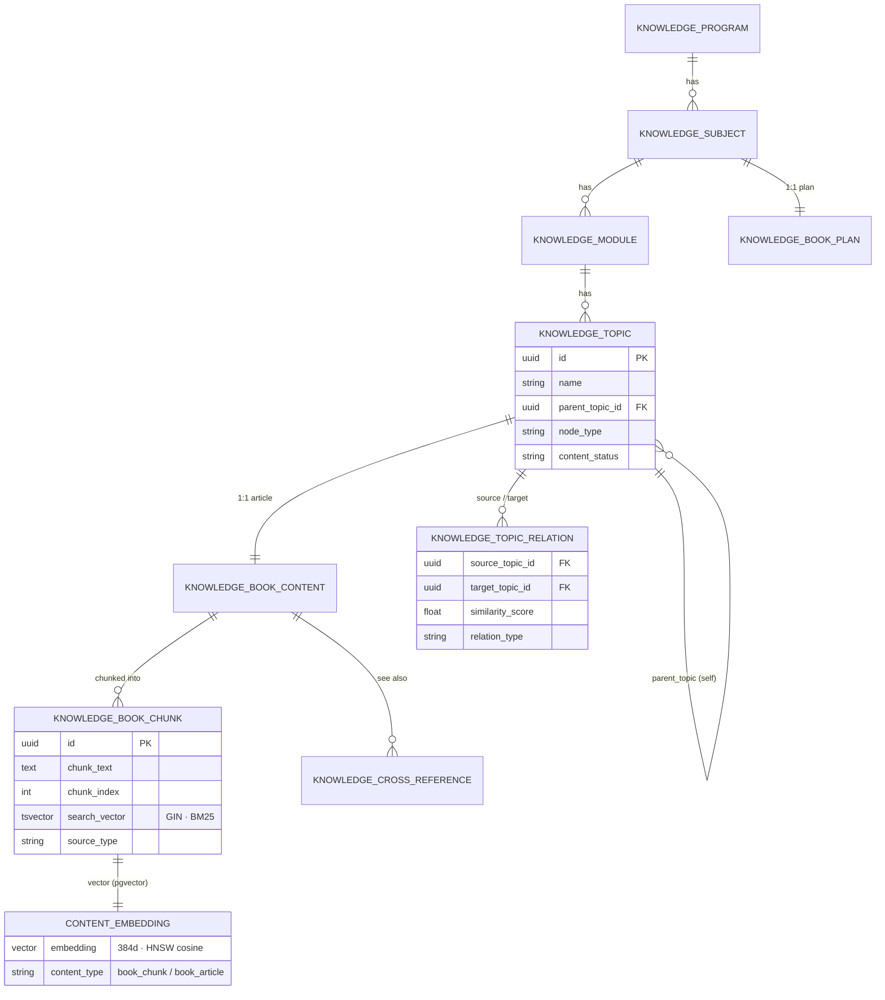
```mermaid
erDiagram
    KNOWLEDGE_PROGRAM      ||--o{ KNOWLEDGE_SUBJECT       : "has"
    KNOWLEDGE_SUBJECT      ||--o{ KNOWLEDGE_MODULE        : "has"
    KNOWLEDGE_MODULE       ||--o{ KNOWLEDGE_TOPIC         : "has"
    KNOWLEDGE_TOPIC        ||--o{ KNOWLEDGE_TOPIC         : "parent_topic (self)"
    KNOWLEDGE_SUBJECT      ||--|| KNOWLEDGE_BOOK_PLAN     : "1:1 plan"
    KNOWLEDGE_TOPIC        ||--|| KNOWLEDGE_BOOK_CONTENT  : "1:1 article"
    KNOWLEDGE_BOOK_CONTENT ||--o{ KNOWLEDGE_BOOK_CHUNK    : "chunked into"
    KNOWLEDGE_BOOK_CHUNK   ||--|| CONTENT_EMBEDDING       : "vector (pgvector)"
    KNOWLEDGE_TOPIC        ||--o{ KNOWLEDGE_TOPIC_RELATION: "source / target"
    KNOWLEDGE_BOOK_CONTENT ||--o{ KNOWLEDGE_CROSS_REFERENCE : "see also"

    KNOWLEDGE_TOPIC {
        uuid   id PK
        string name
        uuid   parent_topic_id FK
        string node_type
        string content_status
    }
    KNOWLEDGE_BOOK_CHUNK {
        uuid     id PK
        text     chunk_text
        int      chunk_index
        tsvector search_vector "GIN · BM25"
        string   source_type
    }
    CONTENT_EMBEDDING {
        vector embedding "384d · HNSW cosine"
        string content_type "book_chunk / book_article"
    }
    KNOWLEDGE_TOPIC_RELATION {
        uuid   source_topic_id FK
        uuid   target_topic_id FK
        float  similarity_score
        string relation_type
    }
```

### 🤖 Research Agent — LangGraph Workflow

The isolated agentic engine: a compiled `StateGraph` of 8 nodes with two conditional loops
(verification retry, reflection re-plan). Runs in the background worker, streams every node
transition over SSE, and checkpoints to Postgres (`PostgresSaver`) so a crashed run can resume.

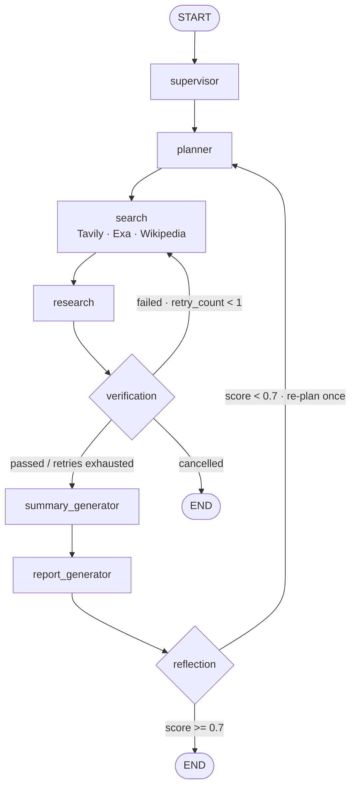
```mermaid
flowchart TB
    START([START]) --> SUP["supervisor"]
    SUP --> PLAN["planner"]
    PLAN --> SEARCH["search<br/>Tavily · Exa · Wikipedia"]
    SEARCH --> RES["research"]
    RES --> VER{"verification"}

    VER -->|passed / retries exhausted| SUM["summary_generator"]
    VER -->|failed · retry_count &lt; 1| SEARCH
    VER -->|cancelled| E1([END])

    SUM --> REP["report_generator"]
    REP --> REF{"reflection"}

    REF -->|score &lt; 0.7 · re-plan once| PLAN
    REF -->|score &gt;= 0.7| E2([END])
```

### 🧠 LLM Pool (Research Agent) — Multi-Provider Failover

Every LLM call routes through one module-level `llm_client` singleton — a multi-provider pool with
**two layers of resilience**. Priority: **groq (`openai/gpt-oss-120b`) → cerebras (`gpt-oss-120b`)**
(Gemini is wired but out of rotation). A caller states a _preference_; the pool guarantees an
_answer_ as long as one provider is alive — the agent never sees the failover.

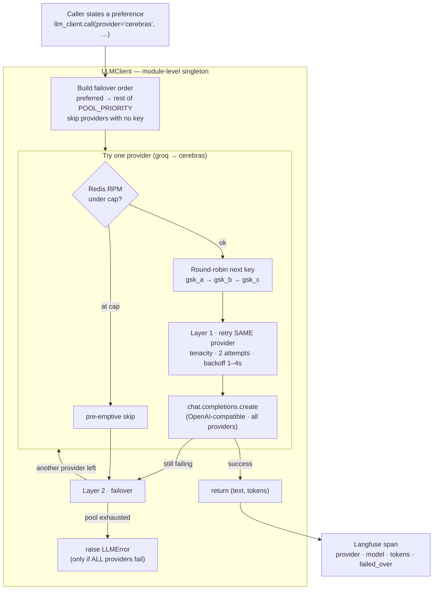
```mermaid
flowchart TB
    CALLER["Caller states a preference<br/>llm_client.call(provider='cerebras', …)"] --> ORDER

    subgraph POOL["LLMClient — module-level singleton"]
        direction TB
        ORDER["Build failover order<br/>preferred → rest of POOL_PRIORITY<br/>skip providers with no key"]
        ORDER --> P1

        subgraph P1["Try one provider (groq → cerebras)"]
            direction TB
            RPM{"Redis RPM<br/>under cap?"}
            RPM -->|at cap| SKIP["pre-emptive skip"]
            RPM -->|ok| KEY["Round-robin next key<br/>gsk_a → gsk_b → gsk_c"]
            KEY --> RETRY["Layer 1 · retry SAME provider<br/>tenacity · 2 attempts · backoff 1–4s"]
            RETRY --> CALL["chat.completions.create<br/>(OpenAI-compatible · all providers)"]
        end

        CALL -->|success| OK["return (text, tokens)"]
        CALL -->|still failing| FO["Layer 2 · failover"]
        SKIP --> FO
        FO -->|another provider left| P1
        FO -->|pool exhausted| ERR["raise LLMError<br/>(only if ALL providers fail)"]
    end

    OK --> TRACE["Langfuse span<br/>provider · model · tokens · failed_over"]
```

### ⚡ Caching Layers

Three cache tiers keep the platform fast on a single 512 MB dyno — edge, response, and data. The
response layer sets `Vary: Authorization` so per-user responses are never served to the wrong user
(a real bug this fixed).

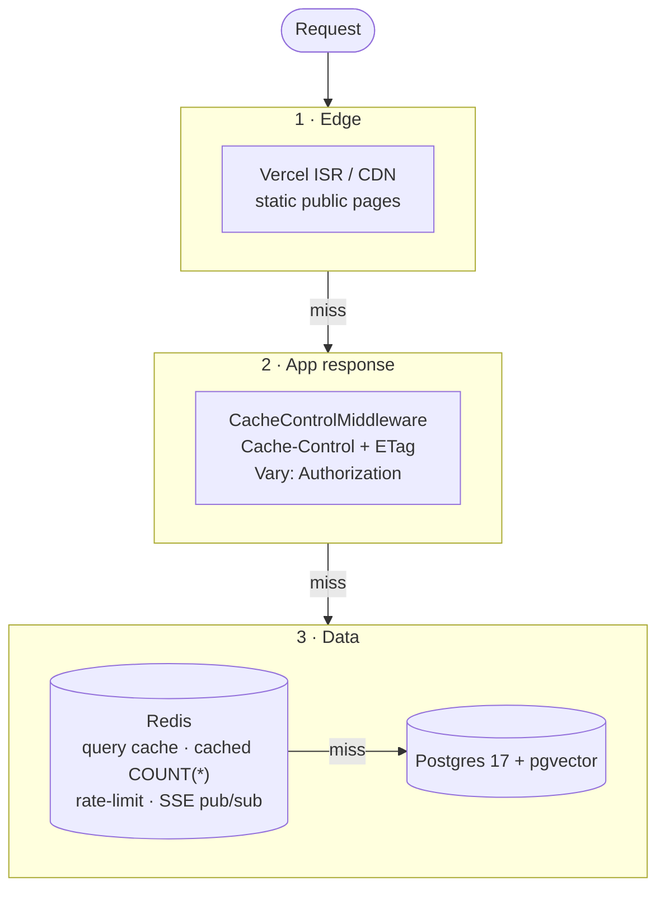
```mermaid
flowchart TB
    REQ([Request]) --> L1

    subgraph L1["1 · Edge"]
        ISR["Vercel ISR / CDN<br/>static public pages"]
    end
    L1 -->|miss| L2

    subgraph L2["2 · App response"]
        CCM["CacheControlMiddleware<br/>Cache-Control + ETag<br/>Vary: Authorization"]
    end
    L2 -->|miss| L3

    subgraph L3["3 · Data"]
        REDIS[("Redis<br/>query cache · cached COUNT(*)<br/>rate-limit · SSE pub/sub")]
        PG[("Postgres 17 + pgvector")]
    end
    REDIS -->|miss| PG
```

---

## 🔭 LLMOps &amp; AgentOps — Operating the Agent

Building an agent is one thing; _operating_ it in production is another. **LLMOps** covers the model
layer — tracing, prompt versions, cost/rate control, and output-quality evaluation. **AgentOps**
covers the workflow — session lifecycle, live streaming, cancellation, crash-resume, and safety.
These four diagrams show the ops layer wrapped around the LangGraph workflow above.

### 🔬 LLMOps · Observability &amp; Tracing (Langfuse)

One trace per session, with a nested observation per agent and per underlying LLM call
(metadata only — never full prompts/reports). The `trace_id` is seeded deterministically from the
`session_id` and stored on `ra_session`, so a developer can jump straight from any session to its
full trace — then **analyze** cost, latency, failovers, and prompt-version quality on the dashboard.

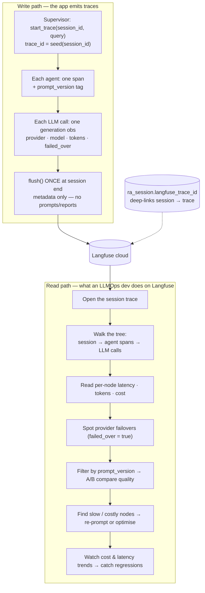
```mermaid
flowchart TB
    subgraph WRITE["Write path — the app emits traces"]
        direction TB
        S1["Supervisor: start_trace(session_id, query)<br/>trace_id = seed(session_id)"]
        S2["Each agent: one span<br/>+ prompt_version tag"]
        S3["Each LLM call: one generation obs<br/>provider · model · tokens · failed_over"]
        S4["flush() ONCE at session end<br/>metadata only — no prompts/reports"]
        S1 --> S2 --> S3 --> S4
    end

    S4 --> LF[("Langfuse cloud")]
    SESS[("ra_session.langfuse_trace_id<br/>deep-links session → trace")] -.-> LF

    subgraph READ["Read path — what an LLMOps dev does on Langfuse"]
        direction TB
        R1["Open the session trace"]
        R2["Walk the tree:<br/>session → agent spans → LLM calls"]
        R3["Read per-node latency · tokens · cost"]
        R4["Spot provider failovers (failed_over = true)"]
        R5["Filter by prompt_version → A/B compare quality"]
        R6["Find slow / costly nodes → re-prompt or optimise"]
        R7["Watch cost &amp; latency trends → catch regressions"]
        R1 --> R2 --> R3 --> R4 --> R5 --> R6 --> R7
    end

    LF --> R1
```

### 📊 LLMOps · Quality Evaluation &amp; Cost Governance

Quality is scored _after_ the user already has the report (never blocks them): a single LLM call
judges four metrics through the same pool, results stay local in `ra_evaluation`, and the confidence
score is back-filled into the Redis cache. Cost is governed by a two-tier Redis limiter.

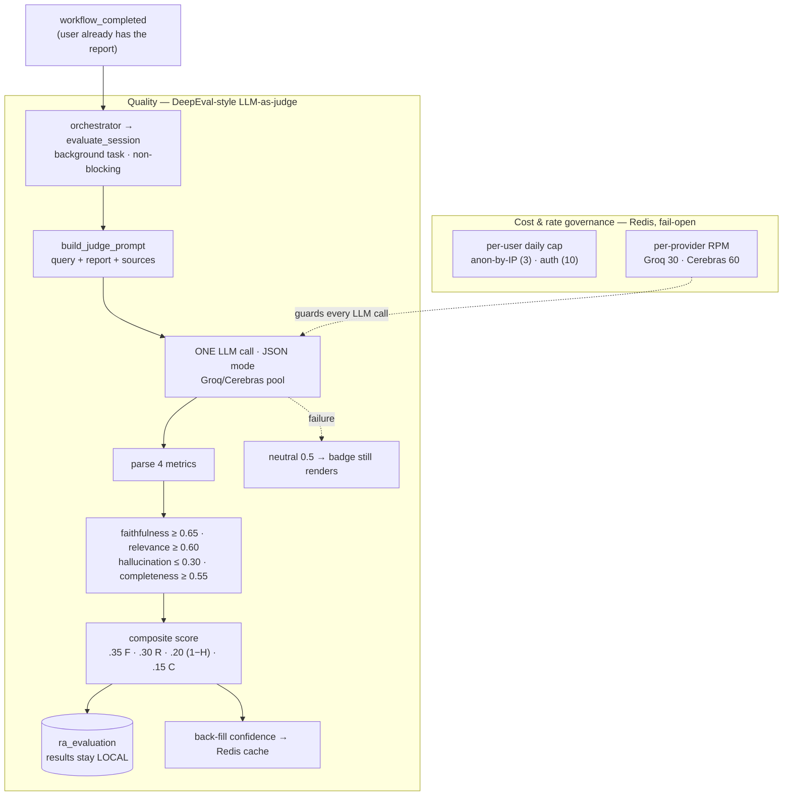
```mermaid
flowchart TB
    DONE["workflow_completed<br/>(user already has the report)"] --> TRIG["orchestrator → evaluate_session<br/>background task · non-blocking"]

    subgraph QUAL["Quality — DeepEval-style LLM-as-judge"]
        direction TB
        TRIG --> JP["build_judge_prompt<br/>query + report + sources"]
        JP --> ONECALL["ONE LLM call · JSON mode<br/>Groq/Cerebras pool"]
        ONECALL --> PARSE["parse 4 metrics"]
        PARSE --> M["faithfulness ≥ 0.65 · relevance ≥ 0.60<br/>hallucination ≤ 0.30 · completeness ≥ 0.55"]
        M --> COMP["composite score<br/>.35 F · .30 R · .20 (1−H) · .15 C"]
        COMP --> SAVE[("ra_evaluation<br/>results stay LOCAL")]
        COMP --> PATCH["back-fill confidence → Redis cache"]
        ONECALL -. failure .-> NEUTRAL["neutral 0.5 → badge still renders"]
    end

    subgraph GOV["Cost &amp; rate governance — Redis, fail-open"]
        direction TB
        U1["per-user daily cap<br/>anon-by-IP (3) · auth (10)"]
        U2["per-provider RPM<br/>Groq 30 · Cerebras 60"]
    end

    U2 -. guards every LLM call .-> ONECALL
```

### 🔄 AgentOps · Session Lifecycle &amp; Orchestration

The orchestrator owns the _lifecycle_; the graph owns the _work_. It runs in a background worker
(never the request thread — Render kills HTTP at 30s), checkpoints after every node so a crash can
resume, and a DB `CHECK` constraint guarantees status can never go invalid.

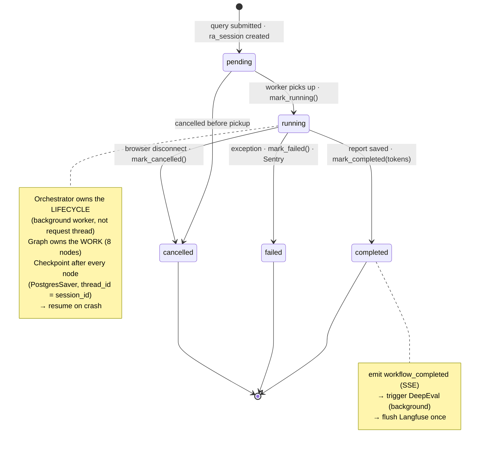
```mermaid
stateDiagram-v2
    [*] --> pending: query submitted · ra_session created
    pending --> cancelled: cancelled before pickup
    pending --> running: worker picks up · mark_running()
    running --> completed: report saved · mark_completed(tokens)
    running --> failed: exception · mark_failed() · Sentry
    running --> cancelled: browser disconnect · mark_cancelled()
    completed --> [*]
    failed --> [*]
    cancelled --> [*]

    note right of running
        Orchestrator owns the LIFECYCLE
        (background worker, not request thread)
        Graph owns the WORK (8 nodes)
        Checkpoint after every node
        (PostgresSaver, thread_id = session_id)
        → resume on crash
    end note
    note right of completed
        emit workflow_completed (SSE)
        → trigger DeepEval (background)
        → flush Langfuse once
    end note
```

### 📡 AgentOps · Live Streaming, Cancellation &amp; Guardrails

The workflow runs in the worker but the browser's SSE connection is held by a _different_ process —
they bridge through Redis pub/sub. A 15s heartbeat beats proxy timeouts; a browser disconnect flips a
Redis cancel flag that every agent checks (so a closed tab stops burning budget). Deterministic
guardrails screen input and sanitize output around the whole run.

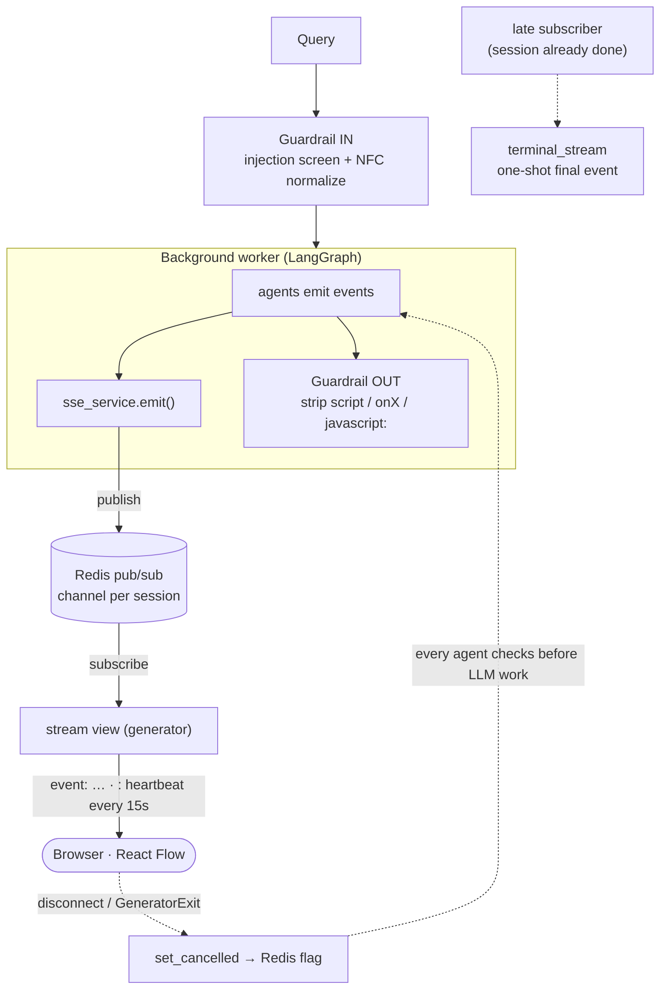
```mermaid
flowchart TB
    Q["Query"] --> GIN["Guardrail IN<br/>injection screen + NFC normalize"]
    GIN --> WORKER

    subgraph WORKER["Background worker (LangGraph)"]
        direction TB
        AG["agents emit events"] --> EMIT["sse_service.emit()"]
        AG --> GOUT["Guardrail OUT<br/>strip script / onX / javascript:"]
    end

    EMIT -->|publish| CH[("Redis pub/sub<br/>channel per session")]
    CH -->|subscribe| STREAM["stream view (generator)"]
    STREAM -->|"event: … · : heartbeat every 15s"| BROWSER([Browser · React Flow])

    BROWSER -. disconnect / GeneratorExit .-> CANCEL["set_cancelled → Redis flag"]
    CANCEL -. every agent checks before LLM work .-> AG
    LATE["late subscriber<br/>(session already done)"] -.-> TERM["terminal_stream<br/>one-shot final event"]
```

---

## 🚀 Local Development Setup

> Local development runs natively (no Docker) on Windows/PowerShell. Docker is used only for CI and
> production-style container testing.

### Prerequisites

- Python 3.11+
- Node.js 20+
- PostgreSQL 17 (with the pgvector extension available)
- Redis (for caching/rate limiting; optional for basic local dev)
- Git

### Backend Setup

```bash
cd backend

python -m venv myvenv
myvenv\Scripts\activate          # Windows
# source myvenv/bin/activate     # Linux/Mac

pip install -r requirements/base.txt -r requirements/dev.txt

copy .env.example .env            # then fill in your local values
python manage.py migrate
python manage.py createsuperuser
python manage.py runserver
```

### Frontend Setup

```bash
cd frontend
npm install
npm run dev
```

### Access

- Frontend: http://localhost:3000
- Backend API: http://localhost:8000/api/v1/
- Admin panel: http://localhost:8000/admin/

### Running Tests

- Backend: `pytest` (from `backend/`) — 699+ tests against a real `pgvector`-enabled Postgres.
- Frontend: `npm test` (from `frontend/`).
- See [🧪 Testing & CI/CD](#-testing--cicd--local--github-actions--render) above for how CI runs
  these in parallel and gates deployment.

---

## 📄 License

This repository is **source-available for viewing and portfolio/reference purposes only**. It is
**not** open source, and no license to use, copy, modify, merge, publish, distribute, sublicense, or
sell any part of this codebase is granted. All rights are reserved by the author.

See [LICENSE](LICENSE) for the full terms.

If you're interested in licensing, collaborating, or discussing this project, please reach out — see
Contact below.

---

## 🔐 Security

If you discover a security vulnerability, please **do not open a public issue**. See
[SECURITY.md](SECURITY.md) for how to report it privately.

---

## 👤 Author

**Vishal Goyal**
Solo-designed and built — backend architecture, RAG pipeline, AI integrations, deployment
infrastructure, and frontend.

---

## 📞 Contact

- **GitHub:** [@vishalgoyal25](https://github.com/vishalgoyal25)
- **Email:** [vishal25goyal25@gmail.com](mailto:vishal25goyal25@gmail.com)
- For security reports, see [SECURITY.md](SECURITY.md).

---

**Built for UPSC aspirants — grounded in real content, not generic AI guesses.**
